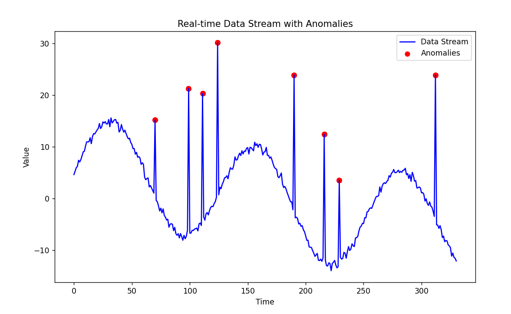

# Anomaly Detection in Real-Time Data Streams

This project implements a real-time anomaly detection system using Exponential Moving Average (EMA) and Z-Score to monitor and detect unusual spikes in continuous data streams. The project supports real-time data visualization and anomaly detection in dynamic data environments.

## Table of Contents

- [Project Overview](#project-overview)
- [Installation](#installation)
- [Usage](#usage)
- [Configuration](#configuration)
- [File Structure](#file-structure)
- [Algorithm Explanation](#algorithm-explanation)
- [Example](#example)

## Project Overview

The goal of this project is to detect anomalies in real-time data streams, such as API traffic or sensor data, by analyzing the data points using Exponential Moving Average (EMA) and Z-Score. Detected anomalies are visualized in real-time using `matplotlib`.

### Core Components
- **Data Stream Simulation**: Generates real-time data with occasional anomalies.
- **Anomaly Detection**: Detects anomalies in the data stream using EMA and Z-Score.
- **Real-Time Visualization**: Continuously updates a plot displaying the data and marking anomalies.

## Installation

### Prerequisites

Ensure you have **Python 3.8** or higher installed. You can download Python from the [official site](https://www.python.org/downloads/).

### Dependencies

Install the required dependencies by running:

```sh
pip install -r requirements.txt
```

This will install the necessary packages, including:
- `numpy`
- `matplotlib`

## Usage

### Running the Project

1. **Clone the repository** and navigate to the project folder.
   
2. **Run the project** with the following command:

   ```sh
   python main.py
   ```

   This will start the simulation, detect anomalies, and display real-time data visualization.

### File Descriptions

- **`main.py`**: The entry point of the project. It initializes the data stream, runs the anomaly detection, and handles visualization updates.
- **`anomaly_detection.py`**: Contains the core logic for detecting anomalies in real-time using EMA and Z-Score.
- **`data_stream.py`**: Simulates a real-time data stream with periodic anomalies.
- **`visualize.py`**: Handles real-time data visualization with `matplotlib`.

## Configuration

You can configure the following parameters in `main.py` and `anomaly_detection.py`:

- **`window_size`**: The number of recent data points used to calculate the EMA and variance. Default is 50.
- **`threshold`**: The Z-Score threshold for anomaly detection. Higher values make detection stricter. Default is 2.
- **`alpha`**: Smoothing factor for the EMA. Controls how much weight is given to new data points. Default is 0.2.

You can modify these parameters to suit your specific use case.

## File Structure

```
.
├── anomaly_detection.py    # Contains the anomaly detection logic using EMA and Z-Score
├── data_stream.py          # Generates a simulated real-time data stream with anomalies
├── main.py                 # Main entry point of the project
├── visualize.py            # Handles real-time visualization of data and anomalies
├── requirements.txt        # Project dependencies
└── README.md               # Project overview and instructions
```

## Algorithm Explanation

The anomaly detection algorithm in this project is based on two key concepts: **Exponential Moving Average (EMA)** and **Z-Score**.

### Exponential Moving Average (EMA)
EMA is a type of moving average that gives more weight to recent data points. This makes it more responsive to changes in the data stream compared to a simple moving average. We use EMA to calculate both the average value and the variance of recent data points within a fixed **window** (defined by `window_size`).

EMA is updated as new data points arrive using the formula:
```
EMA = α * (new_data_point) + (1 - α) * EMA_previous
```
Where:
- **α (alpha)** is the smoothing factor that determines how much weight is given to the latest data point. A higher `alpha` gives more weight to recent data, while a lower `alpha` makes the EMA smoother and slower to react.

### Z-Score for Anomaly Detection
Once we calculate the EMA and the variance (which is also smoothed using EMA), we compute the **Z-Score** for each incoming data point. The Z-Score measures how far the current data point is from the expected value (EMA), relative to the standard deviation (calculated from the variance).

The formula for Z-Score is:
```
Z-Score = (data_point - EMA) / EMA_standard_deviation
```
If the absolute value of the Z-Score exceeds the configured `threshold`, the data point is flagged as an **anomaly**. This approach ensures that we catch points that are statistically far from what is considered normal, based on recent trends.

### Effectiveness
This combination of EMA and Z-Score is effective for real-time anomaly detection because:
- **EMA** allows for tracking trends in a smooth way, giving higher importance to recent data points.
- **Z-Score** quantifies how unusual a data point is relative to recent data trends, making it easy to detect spikes or drops that deviate significantly from normal behavior.

This approach is lightweight and can adapt to concept drift, where the underlying data distribution may change over time, making it suitable for real-time systems such as monitoring API traffic, sensor data, or stock prices.

## Example

Running the project will generate a real-time plot displaying the data stream. Anomalies are marked in red on the plot.
